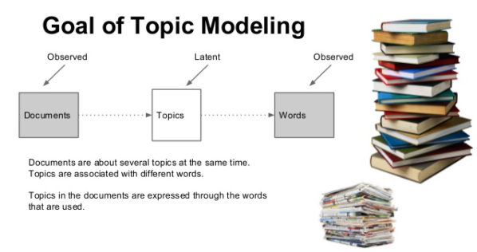
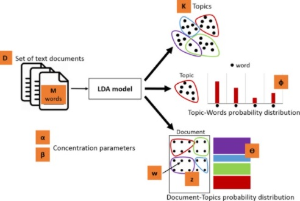
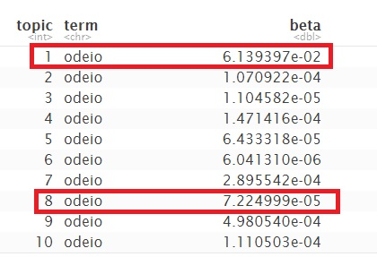
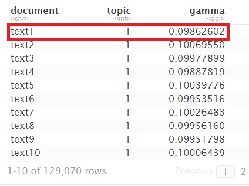
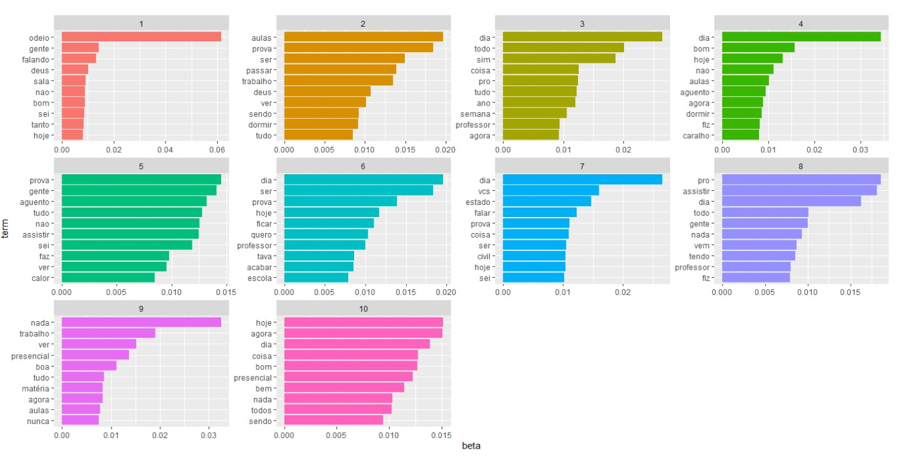
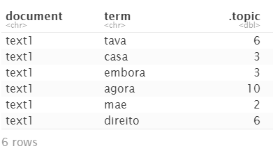

##  Minerando textos do Twitter com extração de tópicos LDA

### <font color="blue">Ensino a Distância, Amigável ou uma Não-relação?</font>

<p style="text-align:justify">Esta é uma questão pertinente, em um momento tão complexo. Diante de uma pandemia severa, que exigiu isolamento social prolongado, as redes sociais tornaram-se os principais pontos de encontro possíveis. Nessa reinvenção do mundo, a educação precisou se adaptar, e pior, abruptamente. Grande parte dos estudantes, de um momento para o outro, se viram diante de uma situação jamais imaginada; ter de estudar de forma on-line, gostando ou não.</p>

<p align="center">

  </p>
  
<p style="text-align:justify">O Twitter é uma rede social que possui um serviço de micro blog para comunicação em tempo real, usado por milhões de pessoas e organizações, sendo esse um ótimo lugar para extrair dados relacionados a opiniões de usuários sobre os mais variados assuntos</p>

<p style="text-align:justify">Este projeto por objetivo fazer um estudo do textos do Twitter sob o termo de pesquisa “EAD”, utilizando um método não supervisionado de aprendizagem de máquina, LDA - Latent Dirichlet Allocation, um modelo altamente estatístico, que relaciona palavras por meio de tópicos latentes.</p>

O projeto foi desenvolvido no software R Studio. A tabela a seguir apresenta a estrutura de desenvolvimento.

-------------

| Etapas|  Twitter text mining|
|:--------- | :------: | 
| 1 |  Coletar Tweets  |
| 2| Pré- Processamento: Limpeza dos dados|
| 3 | Processamento: Extração de tópicos com LDA|


------------------

### Etapa 1 Coletar Tweets 

<p style="text-align:justify">Foi instalado o pacote `rtweet`, para coletar os dados. Importante lembrar que precisa ter um conta developer no Twitter e que o limite máximo de extração é de 18.000 tweets, a cada 15 minutos.</p>

```{r}
EAD_Tweets <- search_tweets(
"EAD", n = 18000, include_rts = TRUE,lang = "pt")
```

Salvar e comprimir o arquivo.

```{r}
readr::write_rds(EAD_Tweets,"dados/EAD_Tweets.rds", compress = "xz")
```

### Etapa 2 Pré-processamento: Limpeza dos dados 

<p style="text-align:justify">A limpeza textual uniformiza letras maiúsculas e minúsculas, remove símbolos, pontuação, stopwords, entre outros. Tudo que é estranho ao texto é removido, por não agregar valor semântico a análise.</p>


<p style="text-align:justify">O comando, <i>distinct</i> vai retirar as linhas repetidas, os retweets, que podem influenciar resultado da análise. Com o pacote <i>quanteda.</i> os dados são convertidos em corpus.</p>

Pacotes aplicados nesta etapa: `dplyr` e `quanteda`.

```{r}
library(dplyr)
library(quanteda)

EAD_text <- EAD_Tweets %>% 
  select(text) %>% 
  distinct() 
  EAD_text_corpus=corpus(EAD_text)
```

<p style="text-align:justify">No corpus é feita a limpeza dos dados, retirando-se as partes desnecessárias, uniformizando os textos e ao final transformando este corpus em uma matriz.</p> 

```{r}
dfm_corpusEAD = EAD_text_corpus %>%
  tokens(remove_punct = TRUE, remove_numbers =TRUE, remove_symbols = TRUE) %>%
  tokens_remove(stopwords("pt")) %>% #remove pontuações, números e símbolos 
    tokens_remove(c("ead","assim","nesse","pra","merda","fazer","vai","ainda","vou","aqui","aula","fazendo","ter")) %>%
  tokens_remove(min_nchar=3) %>% # remove palavras com frequência < 3
  dfm(tolower = TRUE, # transforma todas as palavras em  minúsculas
      stem=FALSE) %>% # usa apenas o radical da palavras
  dfm_trim(min_docfreq = 0.001, docfreq_type = "prop")# mudança de corpus para uma matriz
```

Pode ser que tenha ficado alguns documentos vazios, é preciso retirá-los.

```{r}
corpus_2 <-corpus_subset(EAD_text_corpus, ntoken(dfm_corpusEAD) > 0)
dfm_corpusEAD<- dfm_subset(dfm_corpusEAD, ntoken(dfm_corpusEAD) > 0)
```

#### Topfeatures 

<p style="text-align:justify">Parte do pré processamento importante para avaliar se precisa retirar mais palavras que podem poluir a análise.</p>

```{r}
topfeatures(dfm_corpusEAD, n=50)
```
<p style="text-align:justify">Talvez haja necessidade de rodar o código várias vezes, para uma boa depuração. Cabe ao cientista de dados avaliar quais palavras devem ser retiradas.</p>


### Etapa 3 Processamento: Extração de tópicos com LDA

<p style="text-align:justify">Dentro do text mining, há diversos tipos de análises que vão de acordo com o interesse de cada pesquisador ou analista. Um dos principais interesses é descobrir quais tópicos são os mais recorrentes dentro do corpo de diferentes documentos. Os tópicos são estruturas com valor semântico, que formam grupos de palavras que frequentemente ocorrem juntas. Esses grupos de palavras, quando analisados, dão indícios da existência de um tema ou assunto que ocorre em um subconjunto de documentos.</p>

<p style="text-align:justify">Um tópico leva em conta que o assunto tratado em uma coleção de documentos é extraído automaticamente. É definido como um conjunto de palavras que frequentemente ocorre em documentos semanticamente relacionados.</p>

<p align="center">

  </p>
  
<p style="text-align:justify">O Latent Dirichlet Allocation (LDA) é um dos algoritmos mais comuns para modelagem de tópicos. Sem mergulhar na matemática por trás do modelo, podemos entendê-lo como sendo guiado por dois princípios.</p>

<p style="text-align:justify"><font color="red">Todo tópico é uma mistura de palavras</font>: cada tópico é constituído por palavras relevantes identificadas nos documentos de uma coleção.Por exemplo, poderíamos imaginar um modelo de dois tópicos de notícias americanas, com um tópico para "política" e outro para "entretenimento". As palavras mais comuns no tópico de política podem ser “Presidente”, “Congresso” e “governo”, enquanto o tópico de entretenimento pode ser composto por palavras como “filmes”, “televisão” e “ator”. É importante ressaltar que as palavras podem ser compartilhadas entre os tópicos; uma palavra como “orçamento” pode aparecer em ambos igualmente.</p>

<p style="text-align:justify"><font color="red">Todo documento é uma mistura de tópicos</font>: cada documento pode conter palavras de vários tópicos em proporções específicas. Por exemplo, um determinado documento em uma coleção de produtos poderia ser composto por uma mistura de 50% sobre o tópico A, 30% sobre B e 20% sobre C; enquanto outro documento poderá ser composto por 30% sobre o tópico A, 20% sobre B, 30% sobre C, e 20% sobre D.</p>

<p style="text-align:justify">LDA é um método matemático para estimar ambos ao mesmo tempo: encontrar a mistura de palavras que está associada a cada tópico, enquanto também determina a mistura de tópicos que descreve cada documento.</p>

#### Um modelo LDA é definido por dois parâmetros:

<p style="text-align:justify"><b>α</b>: a frequência média da ocorrência de cada tópico em um determinado documento. Um alto valor de α significa que cada documento provavelmente conterá uma maior mistura de tópicos. Um valor baixo para α indica maior probabilidade de os documentos conterem mistura de poucos tópicos.</p>


<p style="text-align:justify"><b>β</b>: a distribuição de palavras por tópico. Da mesma forma, um valor alto para β significa que cada tópico terá alta probabilidade de conter misturas de várias palavras. Um valor baixo sugere que o tópico será formado por poucas palavras.</p>

A figura abaixo ilustra o processo LDA. 

<p align="center">

  </p>
  

Para dar inicío será usado função lDA  do pacote `topicmodels` para criar um modelo de dez tópicos, usando setting k = 10. Esta função retorna um objeto contendo todos os detalhes do ajuste do modelo, como como as palavras são associadas aos tópicos e como os tópicos são associados aos documentos.


```{r}
library(topicmodels)

ead_lda <- LDA(dfm_corpusEAD, k = 10, control = list(seed = 1234))
ead_lda
```

O modelo já foi ajustado, agora a análise envolverá explorar e interpretar o modelo usando funções de arrumação do pacote `tidytext`, nele será usado um método  que permite  extrair as probabilidades segundo os parâmentros citados anteriormente, começando pelo  parâmetro *beta*, palavras por tópicos.


de palavras por tópico,

```{r}
library(tidytext)

beta_topics <- tidy(ead_lda, matrix = "beta")
beta_topics

```

<p align="center">

  </p>10<sup>-2</sup>
  
<p style="text-align:justify">Pode -se observar que este comando transformou o modelo em um formato de um tópico por termo por linha, ou seja, para cada combinação, o modelo calcula a probabilidade desse termo ser gerado a partir desse tópico.</p>

<p style="text-align:justify">O termo"odeio" por exemplo, tem uma probabilidade de 6.139397x10<sup>-2</sup>  de ser gerada a  partir do tópico 1, enquanto que no tópico 8 é de 7.2249996x10<sup>-5</sup>.</p>


Além de estimar cada tópico como uma mistura de palavras, o LDA também modela cada documento como uma mistura de tópicos. Dessa vez o cálculo  será para examinar a probabilidades por documento por tópico, o parâmetro *gamma*, ou seja, um alto valor, significa que cada documento provavelmente conterá uma mistura maior de tópicos. Um valor baixo, indica maior probabilidade de os documentos conterem mistura de poucos tópicos.


```{r}
gamma_topics <- tidy(ead_lda, matrix = "gamma")
gamma_topics

```
<p align="center">

  </p>

<p style="text-align:justify">Cada um desses valores é uma proporção estimada de palavras desse documento geradas a partir desse tópico. Por exemplo, o modelo estima que apenas cerca de 9% das palavras no documento "text1" foram geradas a partir do tópico 1.</p>

Uma forma de compreender estes parametros é por meio da vizualização gráfica. O top_n do pacote `dplyr`, encontra os 10 termos mais comuns em cada tópico.

```{r}
library(ggplot2)
library(dplyr)

ead_top_termos <- ead_prob_topics %>%
  group_by(topic) %>%
  top_n(10, beta) %>%
  ungroup() %>%
  arrange(topic, -beta)

ead_top_termos %>%
  mutate(term = reorder_within(term, beta, topic)) %>%
  ggplot(aes(term, beta, fill = factor(topic))) +
  geom_col(show.legend = FALSE) +
  facet_wrap(~ topic, scales = "free") +
  coord_flip() +
  scale_x_reordered()
```
<p align="center">

  </p>
  
<p style="text-align:justify">Esta visualização permite compreender os dez tópicos extraídos a partir dos tweets. Pode ser observado que quando se trata do termo "EAD", os tópicos apresentam até uma certa similaridade sobre o tema EAD.</p>

Também é possivel fazer um outro tipo de varredura, descobrir em qual topico e documento que se  encontra um determinado termo usando a função *augment* do pacote`tidytext` .

```{r}
text_topic <- augment(ead_lda)
head(text_topic)

```


<p align="center">

  </p>


### Conclusão Parcial

<p style="text-align:justify">São muitos os desafios a serem explorados quando se trata de extração de tópicos de LDA. Em linhas gerais, com o uso o tidy() foi possível explorar e compreender um pouco desse modelo usando dplyr e ggplot2, onde visivelmente os tópicos apresentam termos que expressam insastifação no modelo de ensino EAD, mas isso ainda não responde a pergunta incial, é necessário seguir outras etapas como analise de sentimentos, por exemplo,mas isso fica para mais adiante, em breve.</p>
 


### Referências

Revista Poli [Alocação de Tópicos Latentes](http://revistas.poli.br/index.php/repa/article/view/1179/592)

Livro[Text Mining with R](https://www.tidytextmining.com/topicmodeling.html#summary-5)


